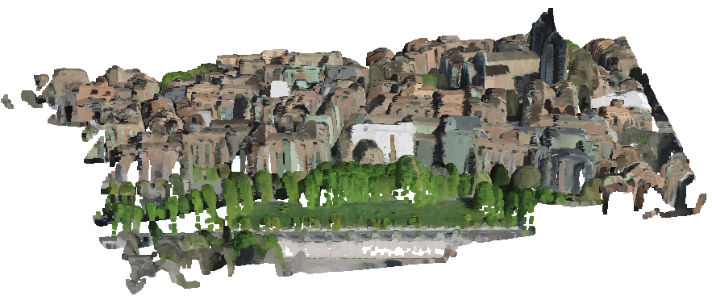
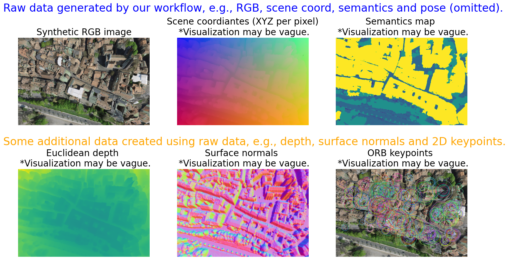
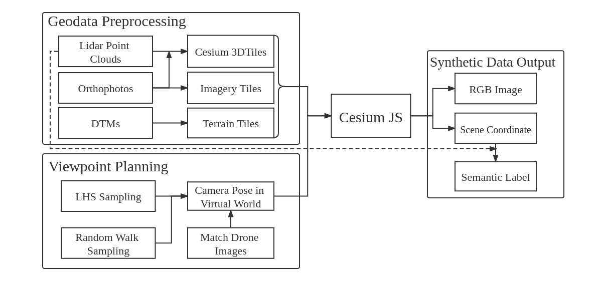

# TOPO-DataGen: an open and scalable aerial synthetic data generation workflow

* [Introduction](#Introduction)
* [Get Started](#Get-Started)
* [General Data Flow](#General-Data-Flow)
* [Code Structure](#Code-Structure)
* [Acknowledgements](#Acknowledgements)
* [Citation](#Citation)

# Introduction






This repo introduces an open and scalable aerial synthetic data generation workflow **TOPO-DataGen**. It takes common *geo-data* as inputs and outputs diverse synthetic visual data such as *2D image-3D geometry-semantics-camera pose*. The rendering engine is developed upon [**CesiumJS**](https://cesium.com/platform/cesiumjs/).

Supported input formats:

* orthophoto (usually `.tif`)
* digital terrain model (usually `.tif`)
* point cloud with classification (usually `.las`)

Expected output:

* synthetic RGB image
* scene coordinates in ECEF, i.e., point cloud associted with each pixel
* semantics label

One may further create 2D/3D data using the above outputs such as:

* depth (z-buffer or Euclidean)
* surface normal vectors
* 2D/3D keypoints

Last update: 12.28.2021


The TOPO-DataGen workflow is officially presented in the paper
<br>
**CrossLoc: Scalable Aerial Localization Assisted by Multimodal Synthetic Data**
<br>
[Qi Yan](https://qiyan98.github.io/), [Jianhao Zheng](https://jianhao-zheng.github.io/), [Simon Reding](https://people.epfl.ch/simon.reding/?lang=en), [Shanci Li](https://people.epfl.ch/shanci.li/?lang=en), [Iordan Doytchinov](https://people.epfl.ch/iordan.doytchinov?lang=en) 
<br>
École Polytechnique Fédérale de Lausanne (EPFL)
<br>
Links: **[arXiv](https://arxiv.org/abs/2112.09081) | [code repos](https://github.com/TOPO-EPFL/CrossLoc)**

# Get Started

**Minimum system requirement:**

* OS: `Ubuntu 20.04 / 18.04`
* [`firefox`](https://www.mozilla.org/en-US/) browser (headless node might not work)
* [`conda`](https://docs.conda.io/en/latest/) environment
* a reliable Internet connection is preferred

**Install dependencies:**

```bash
sudo bash setup/install.sh
```

Note: the `sudo` rights is needed for some Linux dependencies such as `docker` and `nodejs`.

**Data preprocessing:**

Please refer to [`data_preprocess/notes.md`](data_preprocess/notes.md) for data preprocessing steps. We provide a quick `demo` dataset for you to explore and reproduce the workflow using an open-sourced geodata database. The provided `EPFL` and `comballaz` assets are respectively used to produce the `urbanscape` and `naturescape` sets in our [**CrossLoc Benchmark Datasets**](https://github.com/TOPO-EPFL/CrossLoc-Benchmark-Datasets).

Please note that there is no strictly standardized data preprocessing steps, and it is out of the scope of this repo.

**Start data generation:**

To initiate the `demo` data rendering, simply run:

```bash
export OUT_DIR=$HOME/Documents/Cesium
python scripts/start_generate.py demo-LHS demo -p scripts/presets/demo.json -cesiumhome $OUT_DIR 
```

After the rendering is finished, we suggest running the helper scripts to clean the data and do some simple sanity check as follows:

```bash
# please refer to the code for detailed implementation
# the data cleaning and sanity check are based on some intuitive rules, and they do not guarantee a perfect dataset afterwards

export LAS_DIR=$(pwd)/data_preprocess/demo/demo-surface3d/ecef-downsampled  # demo data preprocessing default path
python scripts/remove_outliers.py --input_path $OUT_DIR/demo-LHS --las_path $LAS_DIR --save_backup

python scripts/tools/scan_npy_pointcloud.py --label_path $OUT_DIR/demo-LHS --threshold 25
```

**Retrieve semantics:**

Please note that we retrieve the pixel-wise semantic label based on the classified point cloud and scene coordinate. For each pixel in the frame, the closest matching point in the classified point cloud is identified and its class is used as the label. 

We highly recommend to first clean the data (last step) to remove the outliers outside the boundary of the classified point cloud, as it improves the semantic recovery efficiency and quality.

```bash
# CUDA device is preferred as the matrix computation could be much faster
export SM_DIST_DIR=$OUT_DIR/demo-LHS-sm-dist
python scripts/semantics_recovery.py --input_path $OUT_DIR/demo-LHS --las_path $LAS_DIR \
											  --output_path_distance $SM_DIST_DIR
```

**Preview the data:**

Please refer to `scripts/tools/data_preview.ipynb` notebook to visualize and preview the data.

Other helper scripts like `npy_to_txt_pointcloud.py`, `plot_depth_images.py`, `plot_semantics_images.py` could also be found at `scripts/tools`.

# General Data Flow



Please note that many other 2D/3D data could be generated based on the raw data output, for example:

* camera pose + absolute scene coordinate ---> depth / surface normals
* RGB image + absolute scene coordinate ---> point cloud with color
* camera pose + RGB image ---> temporal video sequence

The many possibilities to generate downstream tasks are omitted in the diagram.

Note that we produce **depth** and **surface normal** through homogeneous transformation and `open3d` respectively. As long as the scene coordinate and 6D camera pose are available, many other 3D labels are relatively easy to compute.

# Code Structure

```
├── assets                            # doc assets
├── data_preprocess                   # utility to preprocess the data, see the `notes.md` for guidline
├── scripts
│   ├── presets                       # preset files defining camera poses in the virtual world
│   ├── tools                         # helper scripts for sanity check and visualization
│	├── random_walk.py                # script to generate random walk camera poses
│   ├── reframeLib.jar                # coordinate coversion utility adopted from https://github.com/hofmann-tobias/swissREFRAME
│   ├── reframeTransform.py           # script to convert coordinate reference system
│   ├── remove_outliers.py            # script to remove outlier points in the generated scene coordinate data
│   ├── semantics_recovery.py         # script to recover the pixel-wise semantic label
│   └── start_generate.py             # main script for data generation
├── setup                             # utility to setup the environment
├── source                            # JS utilities
│   ├── app.js                        #	main JS script for data generation
│   ├── nd.min.js                     # utility JS script to support numpy data
│   ├── npyjs.js                      # utility JS script to support numpy data
│   └── testmap.js                    # JS script for debug mode
├── index.css                         # CesiumJS utility
├── index.html                        # CesiumJS utility
├── package.json                      # nodeJS dependency list
├── server.js                         # CesiumJS utility
└── testmap.html                      # web for quick debug mode
```

Some tips here:

* To change the resolution of picture , find and mofidy the `container.style.width`  and `container.style.height` defined in `scripts/start_generate.py`. The default resolution is 720*480 px. Beware that a higher resolution takes more time to render.

* To fine tune the detailed rendering parameters in `source/app.js`, the [official documentation](https://cesium.com/learn/cesiumjs/ref-doc/) could be very helpful.

# Acknowledgements

In particular, we thank swisstopo and CesiumJS respectively for their [open-sourced geodata](https://shop.swisstopo.admin.ch/en/products/free_geodata) and [open-sourced rendering engine](https://cesium.com/platform/cesiumjs/). We also appreciate the following open-sourced tools, which greatly simplify the workflow:

* [swissREFRAME](https://github.com/hofmann-tobias/swissREFRAME)
* [Cesium terrain builder](https://github.com/tum-gis/cesium-terrain-builder-docker)
* [Cesium terrain server](https://github.com/geo-data/cesium-terrain-server)
* [GDAL](https://github.com/OSGeo/gdal)
* [PDAL](https://github.com/PDAL/PDAL)
* [entwine](https://github.com/connormanning/entwine)
* [EPT Tools](https://github.com/connormanning/ept-tools)
* [open3d](http://www.open3d.org/)

# Citation

If you find our code useful for your research, please cite the paper:

````bibtex
@article{yan2021crossloc,
  title={CrossLoc: Scalable Aerial Localization Assisted by Multimodal Synthetic Data},
  author={Yan, Qi and Zheng, Jianhao and Reding, Simon and Li, Shanci and Doytchinov, Iordan},
  journal={arXiv preprint arXiv:2112.09081},
  year={2021}
}
````

