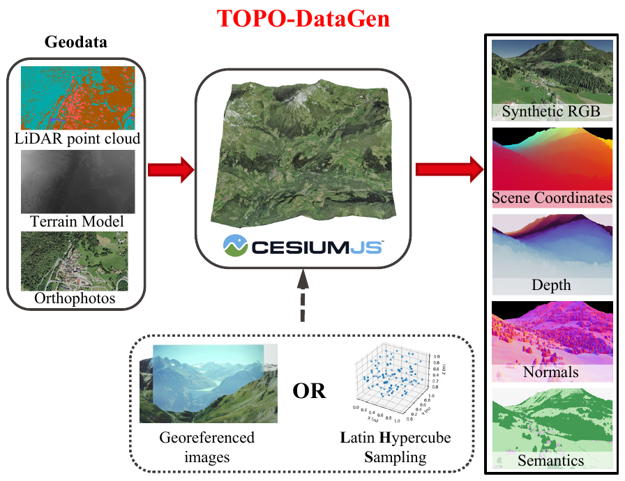

# TOPO-DataGen: an open and scalable aerial synthetic data generation workflow

* [Introduction](#Introduction)
* [Get Started](#Get-Started)
* [Acknowledgements](#Acknowledgements)
* [Citation](#Citation)

# Introduction

<p align="center">
  
</p>

<p align="center">
  
</p>


<p align="center">
  
</p>

This repo introduces an open and scalable aerial synthetic data generation workflow **TOPO-DataGen**. It takes common 
*geo-data* as inputs and outputs diverse synthetic visual data such as *2D image-3D geometry-semantics-camera pose*. 
The rendering engine is developed upon [**CesiumJS**](https://cesium.com/platform/cesiumjs/).

Supported input formats:

* orthophoto (usually `.tif`)
* digital terrain model (usually `.tif`)
* point cloud with classification (usually `.las`)

Expected output:

* synthetic RGB image
* scene coordinates in ECEF, i.e., point cloud associted with each pixel
* semantics label

One may further create 2D/3D data using the above outputs such as:

* depth (z-buffer or Euclidean)
* surface normal vectors
* 2D/3D keypoints

A full description of the [input](https://topo-datagen.readthedocs.io/en/latest/data.html#input-data) and [output](https://topo-datagen.readthedocs.io/en/latest/data.html#output-data)


# Get Started

See all installation instructions  [here](https://topo-datagen.readthedocs.io/en/latest/requirements.html).

A data processing tutorial is available [here](https://topo-datagen.readthedocs.io/en/latest/tutorial.html)

All command line description can be found  [here](https://topo-datagen.readthedocs.io/en/latest/cmd.html)


# Acknowledgements

In particular, we thank swisstopo and CesiumJS respectively for their [open-sourced geodata](https://shop.swisstopo.admin.ch/en/products/free_geodata) and [open-sourced rendering engine](https://cesium.com/platform/cesiumjs/). We also appreciate the following open-sourced tools, which greatly simplify the workflow:

* [swissREFRAME](https://github.com/hofmann-tobias/swissREFRAME)
* [Cesium terrain builder](https://github.com/tum-gis/cesium-terrain-builder-docker)
* [Cesium terrain server](https://github.com/geo-data/cesium-terrain-server)
* [GDAL](https://github.com/OSGeo/gdal)
* [PDAL](https://github.com/PDAL/PDAL)
* [entwine](https://github.com/connormanning/entwine)
* [EPT Tools](https://github.com/connormanning/ept-tools)
* [open3d](http://www.open3d.org/)


The TOPO-DataGen workflow is officially presented in the paper
<br>
**CrossLoc: Scalable Aerial Localization Assisted by Multimodal Synthetic Data**
<br>
[Qi Yan](https://qiyan98.github.io/), [Jianhao Zheng](https://jianhao-zheng.github.io/), 
[Simon Reding](https://people.epfl.ch/simon.reding/?lang=en), [Shanci Li](https://people.epfl.ch/shanci.li/?lang=en), 
[Iordan Doytchinov](https://people.epfl.ch/iordan.doytchinov?lang=en) 

École Polytechnique Fédérale de Lausanne (EPFL)
<br>
Links: **[arXiv](https://arxiv.org/abs/2112.09081) | [code repos](https://github.com/TOPO-EPFL/CrossLoc)**


# Citation

If you find our code useful for your research, please cite the paper:

````bibtex
@article{yan2021crossloc,
  title={CrossLoc: Scalable Aerial Localization Assisted by Multimodal Synthetic Data},
  author={Yan, Qi and Zheng, Jianhao and Reding, Simon and Li, Shanci and Doytchinov, Iordan},
  journal={arXiv preprint arXiv:2112.09081},
  year={2021}
}
````